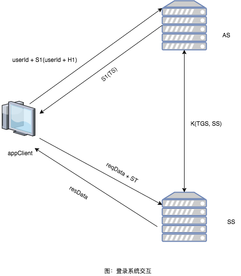

# 本系统的设计方案

借鉴kerberos协议的思想，设计一套安全的登录系统

名词定义

AS: Authentication Server，认证服务器

SS: 业务服务器

PWD: 用户的密码明文

H1: PWD的一次哈希，此处哈希算法采用MD5，即 H1 = MD5\(PWD\)

S1: H1的加盐哈希，即 S1 = MD5\(H1 + SALT\)

K\(AS, SS\): AS 和 S直接的共享对称加密密钥

