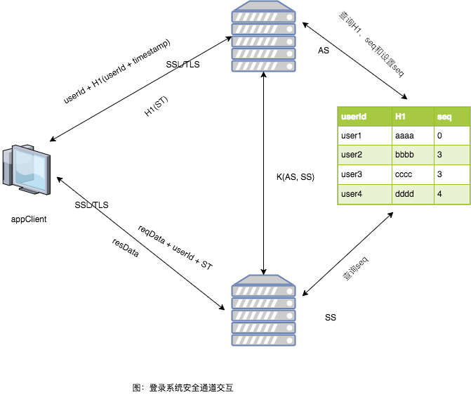

# 本系统的登录设计方案

## 借鉴kerberos协议的思想，设计一套安全的登录系统

### 名词定义

AS: Authentication Server，认证服务器

SS: 业务服务器

PWD: 用户的密码明文

H1: PWD的哈希，此处哈希算法采用argon2，即 H1 = argon2\(PWD, ...\)。argon2算法是2015年的Password ashing Competition冠军 [https://github.com/P-H-C/phc-winner-argon2](https://github.com/P-H-C/phc-winner-argon2)，该算法能够动态控制内存和cpu消耗，是一种非常安全的密码hash算法。

K\(AS, SS\): AS 和 SS之间的共享对称加密密钥

ST: session ticket，作为appClient访问SS的session ticket，生成规则为用K\(AS, SS\)作为密钥加密userId和时间戳 等数据，ST = K\(AS, SS\)\(userId + timestamp + ...\) 。

### 登录系统交互流程

#### appClient向AS申请ST:

appClient用H1作为对称加密密钥，加密userId和timestamp，发送给AS

AS收到appClient的请求后，根据userId在数据库中查找H1，解出 userID + timestamp，判断userID没有被篡改，生成ST，用S1作为密钥加密后发给appClient

#### appClient请求业务服务器服务:

在请求数据中带上请求业务参数数据、userID、ST等

业务服务器收到后，验证ST的有效性，如果ST有效，则返回业务响应数据给appClient。

#### SS如何验证ST:

SS用K\(AS, SS\)解密ST，得到userId，timestamp等，判断userId是否跟用户请求带的userId是否相同，并且判断时间戳是否过期。

### 登录系统安全性

考虑最坏情况下，存储userId 和 S1的数据库被拖库，黑客知道了S1，该设计方案的安全性。

#### 伪造客户端和重放：

黑客知道H1，可以算出H1\( userId + timestamp\)，因此可以伪造成客户端请求AS。黑客不能通过重放伪造客户端，userId + S1\(userId + H1 + timestamp\)中带了时间戳，过期的登录请求会被拒绝。黑客可以通过窃听ST，用ST直接伪造成客户端请求SS。所以是黑客是可以伪造客户端请求SS的。

#### 中间人攻击：

黑客不知道K\(AS, SS\)，无法伪造ST，所以无法伪造AS服务器，中间人攻击无法施行。

#### 窃听和篡改：

黑客知道了S1，在1\(ST\)中，可以篡改和窃听ST。

因此拖库会造成很大的安全风险: 黑客可以伪造客户端请求SS，黑客可以窃听和篡改ST。

## 解决本系统的安全风险

为了解决拖库问题，需要在对称加密体系中，引入非对称加密。

### SSL/TLS协议

是一种非对称加密和对称加密结合起来的安全协议，被广泛应用于网络应用中，比如HTTPS，就是在http协议之上再构建一个SSL/TLS协议。

SSL/TLS wiki: [https://en.wikipedia.org/wiki/Transport\_Layer\_Security](https://en.wikipedia.org/wiki/Transport_Layer_Security)

在三次TCP握手建立TCP通道后，SSL/TLS协议会进行4次握手，建立安全加密通道。在四次握手中，协商对称加密算法，交互各自的证书，并且验证证书完整性，最终用非对称加密算法协商完对称加密的秘钥，四次握手结束，安全通道建立，通信双方后续用对称加密算法进行通信。

### 改造后的设计方案

因此，本设计方案只需要进行适当的改造，即可预防拖库造成的风险。

SSL/TLS协议已经被证明是高效、可靠和安全的协议，HTTPS的广泛应用可以证明这个事实。

加入SSL/TLS后，即使被拖库：

黑客无法伪造客户端与SS通信，即使有H1，黑客也无法窃听SSL/TLS安全通道。

黑客无法窃听和篡改ST，因为用户无法窃听和篡改SSL/TLS安全通道。

## 注册功能设计

注册功能实现了将H1和userId的绑定，注册流程同样是通过SSL/TLS通道进行的，流程如下：

客户端提交H1，AS生成新的userId，将H1和userId保存为新的用户，将userId返回给用户。

如果没有SSL/TLS通道的保证，这一步是很脆弱的，因为将H1在网上上传输很容易被黑客拿到，黑客知道了H1便可以通过其他手段伪造客户端登录请求，窃听数据等。

即使被拖库，黑客无法窃听和篡改SSL/TLS通道，此时虽然知道H1，但是由于argon2算法的安全性，黑客碰撞出密码几乎不可能，因此也就无法伪造登录。

## 单一设备登录设计

用户只能在一个设备上登录，切换登录终端时，其他已经登录的终端会被踢出。为了实现该功能，需要在用户在其他终端登录后，将上一个ST失效，并将用户的连接断开。

### 表的改造

在AS的登录验证中，维护了一个数据库表tb\_login\_info，tb\_login\_info表字段大概如下：

| userID | H1 |
| --- | --- |
| kingweicai | abcdefg |

为了保证新的登录生成的ST可以把原来的ST失效，需要给ST绑定一个id，并且将当前登录有效的ST的id保存在tb\_login\_info表中：

| userID | H1 | seq |
| --- | --- |
| kingweicai | abcdefg | 1 |

### 算法的改造

ST的生成算法需要优化为：ST = K\(AS, SS\)\(userId + timestamp + seq + ...\)

当有新的登录请求，AS在生成ST时，查询tb\_login\_info，知道当前的seq，将seq+1的值作为新的ST生成算法中的seq，并且更新tb\_login\_info中该userId行的seq为seq+1。

SS验证ST时，需要请求验证tb\_login\_info中该userId行的seq值，如果ST解密出来里面的seq比tb\_login\_info中的seq小的，则该ST是失效的ST，返回登录失效的响应，如果相等则是当前有效的ST正常响应用户请求。

当tb\_login\_info中的seq值增长到很大的时候，需要重新从0开始计数。

### 将用户实时踢出

借助grpc的stream接口，我们可以保持已登录设备和服务器之间的长连接，该连接只需要保持服务器到客户端方向的stream特性，暂时没必要保持双向的stream。

数据结构的设计：

内存中维护了一个map，key为登录的用户的user id，value为最新登录的用户的seq。通过查询某个user id可以知道最新的seq，任何旧的seq的登录连接都会被断开。由于不同的登录请求有可能是在不同线程中处理的，不同线程会对该map进行读写，因此该map需要做好锁的保护，避免多线程之间的数据竞争。

实现了一个 [LoginStreamManager](https://github.com/caijw/loginSystem/blob/master/src/loginStreamManager.h#L16)的单实例类来维护该map。

当有新的登录请求到来，计算该user id的新的seq并且如果其大于map中的，将其更新到map中，保持stream连接的，不断的轮训map查看该user id的seq是否比map中的小，是的话通知客户端退出登录，并且主动断开该stream连接。

这个方案的缺点是需要维护每一个已经登录的用户的stream接口，资源消耗会比较大，同时在分布式环境下，需要将特定的user id的请求hash到指定的机器上，在池子很大的情况下，需要查询map结构并且需要加锁进行互斥，维护成本比较高。

## 根据配置策略将已经登录的设备提出

### 失效ST

读取配置的策略，在tb\_login\_info表中，将命中策略的userId的那一行的值设置为无穷大的值（该值依赖相关数据库的实现），并且更新map结构，这样设置导致当前所有登录的设备都处于登录失效的状态。

用户新登录，AS查询tb\_login\_info表中，seq的值为无穷大，则新的seq需要重新从0开始计数，保证新的登录有效。

### 设备自动下线

对于已经登录的用户，由于服务器保持steam连接中会不断轮训map，当发现map中的seq跟自己的seq不匹配时，会主动通知客户端退出。

