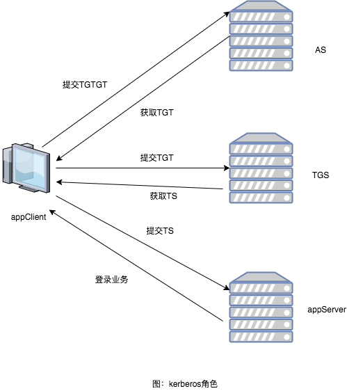
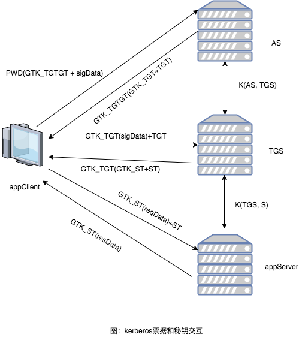

# 业界现有方案

### 一、业界的做法

业界成熟的登录体系，大部分是基于kerberos协议或者对其进行改造而实现的，比如腾讯的qq登录体系。

### 二、kerberos简介

kerberos协议wiki参考 [https://zh.wikipedia.org/wiki/Kerberos](https://zh.wikipedia.org/wiki/Kerberos)，它能在非安全的网络中，防止窃听、防止重放攻击、保证数据完整性，是一种应用对称密钥体制进行密钥管理的系统。

kerberos体系结构中，包含三方四角色，三方是指客户端、鉴权服务器和业务服务器，四角色是指AS\(Authentication Server\)、TGS\(icket-Granting Server\)、appClient、appServer。

在Kerberos流程中，在登录时，首先需要提交TGTGT到AS进行密码验证，如果密码正确则能够得到GTK\_TGTGT。此时生成GTK\_TGT派发TGT，并使用GTK\_TGTGT加密后返回客户端。当客户端收到TGT后，通过TGS换取相应的业务小票ST去访问业务服务器。

### 三、kerberos协议中的各种票据和秘钥

* TGTGT  GTK\_TGTGT

TGTGT也称大大票或者A1，是通过密码相关的密钥加密后生成的票据，其等权限同于密码。同时，客户端生成TGTGT票据时，会其中在包含一个随机密钥GTK\_TGTGT。Server通过解密TGTGT后可以得到GTK\_TGTGT，用于后续安全信道加解密。

* TGT  GTK\_TGT

TGT（Ticket Granting Ticket），也称大票或者A2。从名称可以知道，TGT是用来授权其它低等级票据的票据，是通过TGTGT登录后，由Server派发的高权限登录凭证。Server加密生成的TGT中包含随机密钥GTK\_TGT，并且会与TGT一并通过加密信道返回客户端，用于后续的信道加密。

* ST  GTK\_ST

ST是业务小票，是通过TGT换取的一种业务票据，用于访问业务鉴权，权限较低；与TGT相同，在ST中包含GTK\_ST，会与TGT一并通过加密信道返回客户端，用于后续的信道加密。

* PWD

密码通过运算得到的密钥，只有用户和AS服务器知道

* K\(AS, TGS\)

加密生成TGT的密钥，AS服务器与TGS服务器共享

* K\(TGS, S\)

加密生成ST的密钥，TGS与业务服务器共享

其中，PWD、K\(AS, TGS\)、K\(TGS, S\)是长期秘钥；GTK\_TGTGT、GTK\_TGT、GTK\_TS是临时秘钥。

### 四、kerberos对抗登录攻击

防止窃听:

用户密码并没有在网络上传输，而是使用使用密码通过运算得到的密钥加密的TGTGT进行登录，因此及时登录被窃听也可以保证账户的安全性。在第一条登录命令之后的信道，都是通过服务器派发的TGT、ST，以及与之对应的密钥GTK\_TGT、GTK\_ST加密从而保证信道安全的。

防止伪造客户端、重放:

假设，用户的第一条登录命令在网络中被窃听并且重放伪造用户登录，由于TGTGT不是伪客户端生成的，无法获取GTK\_TGTGT，虽然AS正确回包，却无法解密得到应答的内容，无法登录成功。

防止伪造服务器:

如果用户在发送第一条登录命令时AS服务器被伪造，由于伪造的AS服务器不知道用户密码，因此无法的到GTK\_TGTGT，所以无法正确回包，登录也是无法成功的。

